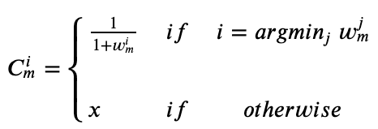
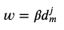
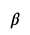

# Weighted Voronoi for Soccer
A Voronoi diagram is a geometric construction that allows to partition the soccer pitch in regions, these regions are called dominance regions.
A Voronoi diagram creates cells delimited by a polygon, it uses the distance to assign a dominion region to the nearest player.

The weighted Voronoi diagram is a variation of the classic diagram, in this approximation a weight function ,$w$, is added, this function allows to control the level of influence that a player can exert over a cell. Each cell can be estimated as

A typical weight function could be , where d is the distance from player $i$ to a location in the pitch $m$ and  can be a constant.

The Voronoi estimates the space dominated by each team considering only the Euclidean distance, while the weighted Voronoi can be modified to account for other parameters that can be time dependants.

## Source Code
* `voronoi_weighted.py`: This script contains visualization and calculation functions for weighted Voronoi.
* `tutorial_voronoi_weighted.ipynb`: This notebook shows how to use the `voronoi_weighted.py`.
